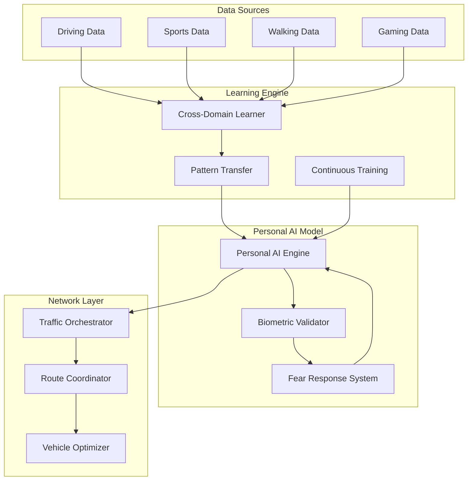

<h1 align="center">Verum</h1>
<p align="center"><em>"Personal Intelligence for Autonomous Navigation"</em></p>

<p align="center">
  
</p>

<div align="center">


</div>

## Abstract

Verum introduces a revolutionary paradigm for autonomous vehicle systems through **Personal Intelligence-Driven Navigation**. Unlike traditional approaches that attempt to generalize across all possible driving scenarios, Verum implements individualized AI models learned from comprehensive multi-domain behavioral data over extended temporal periods (5+ years).

The framework addresses fundamental limitations in current autonomous driving approaches by treating driving as a manifestation of universal human locomotion and avoidance behaviors. Through cross-domain learning from activities including walking, cycling, sports, and daily interactions, Verum constructs personalized navigation models that replicate an individual's specific fear responses, decision-making patterns, and spatial avoidance strategies.

Core innovations include: (1) **Biometric-Behavioral Correlation Engine** for real-time validation of AI performance, (2) **Cross-Domain Pattern Transfer** learning from tennis to driving scenarios, (3) **Fear-Response Learning** that creates appropriate caution patterns, and (4) **Network-Coordinated Personal AI** enabling traffic-wide optimization while maintaining individual driving personalities.

## Table of Contents

- [Theoretical Foundation](#theoretical-foundation)
- [Core Innovation](#core-innovation)
- [Mathematical Framework](#mathematical-framework)
- [System Architecture](#system-architecture)
- [Implementation Components](#implementation-components)
- [Network Coordination Protocol](#network-coordination-protocol)
- [Performance Validation](#performance-validation)
- [Installation](#installation)
- [Usage](#usage)
- [Contributing](#contributing)
- [References](#references)

## Theoretical Foundation

### The Fundamental Problem with Current Approaches

Current autonomous driving systems suffer from the **Infinite Edge Case Problem**: attempting to program responses to every possible driving scenario results in systems that are perpetually incomplete and lack appropriate context-sensitive decision-making capabilities.

**Current Paradigm Limitations:**
- Generalized AI systems lack personal risk tolerance understanding
- No mechanism for learning individual fear responses and caution patterns
- Inability to transfer successful avoidance behaviors across domains
- Lack of real-time performance validation metrics

### The Verum Paradigm: Personal Intelligence Navigation

Verum reconceptualizes autonomous driving through three core principles:

#### 1. Universal Avoidance Intelligence
All human locomotion—walking, cycling, driving—shares a fundamental pattern: **goal-directed obstacle avoidance**. Rather than learning driving-specific rules, Verum learns how an individual navigates through space while pursuing objectives.

#### 2. Cross-Domain Fear Learning
Fear responses that keep humans safe are consistent across activities. A person's reaction to a tennis ball approaching at 100 km/h contains the same defensive patterns that would keep them safe from roadway debris at similar speeds.

#### 3. Biometric Performance Validation
Success is measured not by adherence to traffic rules, but by maintaining the passenger's biometric state within ranges consistent with their personal driving comfort levels.

## Core Innovation

### The Horse Model of Autonomous Intelligence

Verum implements the **Horse Model**: an AI that combines rider responsiveness with independent safety instincts. Like a horse that will not run into a wall regardless of rider commands, Verum AI will not execute actions that trigger learned fear responses, even when requested.

**Key Properties:**
- **Cooperative Intelligence**: Responds to human navigation goals and preferences
- **Independent Safety Instincts**: Refuses to execute actions that violate learned caution patterns
- **Learned Fear Responses**: Develops appropriate hesitation patterns from biometric feedback
- **Context-Sensitive Risk Assessment**: Applies personal risk tolerance dynamically

### Multi-Domain Learning Architecture

```
Personal Navigation Intelligence = f(Driving, Walking, Sports, Gaming, Daily_Navigation)
```

**Data Sources for Pattern Learning:**
- **Primary Locomotion**: Driving, walking, cycling patterns
- **Reactive Sports**: Tennis, basketball defensive patterns  
- **Strategic Games**: Spatial reasoning from video games
- **Daily Navigation**: Shopping routes, building navigation
- **Biometric Responses**: Heart rate, skin conductance during various stress scenarios

## Mathematical Framework

### Cross-Domain Avoidance Transfer Function

The core learning algorithm transfers successful avoidance patterns across domains:

$$A_{driving}(s, t) = \sum_{d \in \mathcal{D}} \alpha_d \cdot \phi_d(s) \cdot P_{success}(a_d | s_d, t)$$

Where:
- $A_{driving}(s, t)$ = driving avoidance action in scenario $s$ at time $t$
- $\mathcal{D}$ = set of all learned domains (tennis, walking, etc.)
- $\alpha_d$ = domain relevance weight for current scenario
- $\phi_d(s)$ = similarity function mapping driving scenario to domain $d$
- $P_{success}(a_d | s_d, t)$ = probability of successful avoidance action in domain $d$

### Biometric Performance Validation Model

Real-time AI performance is validated through biometric state matching:

$$Performance(t) = 1 - \frac{|B_{current}(t) - B_{expected}(t, context)|}{\sigma_{personal}}$$

Where:
- $B_{current}(t)$ = current biometric state vector
- $B_{expected}(t, context)$ = expected biometric state for given context
- $\sigma_{personal}$ = individual's normal biometric variance

### Fear Response Learning Function

The system learns appropriate caution patterns through biometric feedback:

$$Fear_{learned}(scenario) = \frac{\sum_{i=1}^{n} B_{stress}^i \cdot Sim(scenario, scenario_i)}{\sum_{i=1}^{n} Sim(scenario, scenario_i)}$$

Where:
- $B_{stress}^i$ = stress response magnitude in historical scenario $i$
- $Sim(scenario, scenario_i)$ = similarity between current and historical scenarios
- $n$ = number of relevant historical scenarios

### Network Optimization with Personal Constraints

Traffic-wide optimization respects individual AI constraints:

$$\min \sum_{v \in \mathcal{V}} T_v \text{ subject to } \forall v: Stress_v \leq \sigma_{max}^v$$

Where:
- $\mathcal{V}$ = set of all vehicles in network
- $T_v$ = travel time for vehicle $v$
- $Stress_v$ = predicted stress level for passenger in vehicle $v$
- $\sigma_{max}^v$ = maximum acceptable stress for passenger $v$

## System Architecture

### Multi-Layer Intelligence Framework

```
┌─────────────────────────────────────────────────────────────────┐
│                        Verum Framework                          │
├─────────────────────────────────────────────────────────────────┤
│  Layer 5: Network Coordination Engine (Go)                     │
│  ├─ Traffic Orchestration Protocol                             │
│  ├─ Route Optimization with Personal Constraints               │
│  └─ Cross-Vehicle Coordination                                 │
│                                                                 │
│  Layer 4: Personal AI Model Engine (Rust)                      │
│  ├─ Cross-Domain Pattern Recognition                           │
│  ├─ Fear Response Implementation                               │
│  ├─ Real-Time Decision Making                                  │
│  └─ Biometric Performance Validation                          │
│                                                                 │
│  Layer 3: Learning and Adaptation Engine (Python)             │
│  ├─ Multi-Domain Data Integration                              │
│  ├─ Pattern Transfer Algorithms                                │
│  ├─ Personal Model Training                                    │
│  └─ Continuous Learning Pipeline                               │
│                                                                 │
│  Layer 2: Data Collection and Processing (Rust)               │
│  ├─ Real-Time Biometric Processing                            │
│  ├─ Multi-Sensor Data Fusion                                  │
│  ├─ Cross-Activity Pattern Detection                          │
│  └─ Privacy-Preserving Data Management                        │
│                                                                 │
│  Layer 1: Hardware Interface Layer (Rust)                     │
│  ├─ Vehicle Control Systems                                    │
│  ├─ Sensor Integration                                         │
│  ├─ Biometric Device Interfaces                               │
│  └─ Safety Override Systems                                    │
└─────────────────────────────────────────────────────────────────┘
```

### Component Interaction Model



## Implementation Components

### Core Rust Engine: `verum-core`
- **Safety-Critical AI Decision Making**: Real-time driving decisions with formal verification
- **Biometric Processing**: High-frequency sensor data processing and pattern recognition
- **Cross-Domain Pattern Application**: Applying learned patterns from other activities to driving
- **Performance Validation**: Real-time comparison of AI actions with expected biometric responses

### Python Learning Engine: `verum-learn`
- **Multi-Domain Data Integration**: Combining data from driving, sports, walking, gaming
- **Pattern Transfer Algorithms**: Machine learning models for cross-activity pattern recognition
- **Personal Model Training**: Long-term learning pipeline for individual AI development
- **Research and Analysis Tools**: Data science tools for model improvement and validation

### Go Network Coordinator: `verum-network`
- **Traffic Orchestration**: Coordinating multiple personal AI vehicles across traffic networks
- **Route Optimization**: Finding optimal paths while respecting individual comfort constraints
- **Network Protocol**: Communication standards for AI-to-infrastructure coordination
- **Scalability Framework**: Handling city-scale deployment of personal AI vehicles

## Network Coordination Protocol

### Personal AI Model Exchange

When vehicles enter a coordinated network, they exchange **capability profiles** without sharing personal data:

```json
{
  "model_id": "hashed_identifier",
  "stress_tolerance": {
    "highway": "medium",
    "intersections": "low", 
    "parallel_parking": "high"
  },
  "speed_preferences": {
    "preferred_following_distance": 2.3,
    "acceleration_comfort": "gentle",
    "braking_style": "early"
  },
  "route_flexibility": 0.7,
  "time_sensitivity": "medium"
}
```

### Traffic Orchestration Algorithm

The network coordinator optimizes routes for all vehicles while respecting individual constraints:

1. **Personal Constraint Collection**: Each vehicle reports its passenger's current stress tolerance and time constraints
2. **Global Route Optimization**: Calculate optimal traffic flow while maintaining individual comfort levels
3. **Instruction Distribution**: Send personalized route instructions to each vehicle
4. **Personal Execution**: Each AI drives the assigned route in its own learned style

## Performance Validation

### Real-Time Biometric Validation

Success is continuously measured through biometric alignment:

```rust
pub struct BiometricValidator {
    baseline_patterns: PersonalBaseline,
    current_sensors: BiometricSensors,
    tolerance_ranges: ToleranceConfig,
}

impl BiometricValidator {
    pub fn validate_performance(&self, context: DrivingContext) -> PerformanceScore {
        let expected_state = self.baseline_patterns.get_expected_state(context);
        let current_state = self.current_sensors.read_current_state();
        
        self.calculate_alignment_score(expected_state, current_state)
    }
}
```

### Cross-Domain Learning Validation

The system validates that patterns learned from other activities successfully transfer to driving:

```python
class CrossDomainValidator:
    def validate_pattern_transfer(self, 
                                source_domain: str, 
                                target_scenario: DrivingScenario,
                                success_threshold: float = 0.85) -> ValidationResult:
        """
        Validates that patterns from source domain (tennis, walking) 
        successfully apply to driving scenarios
        """
        pass
```

## Installation

See [docs/package/installation.md](docs/package/installation.md) for detailed installation instructions.

## Usage

### Personal AI Model Development

```bash
# Start 5-year personal data collection
verum-learn start-collection --profile personal --duration 5years

# Train cross-domain patterns
verum-learn train-patterns --domains driving,walking,tennis,gaming

# Deploy personal AI model
verum-core deploy-model --model personal_ai_v1.0 --vehicle vehicle_id
```

### Network Coordination

```bash
# Join traffic coordination network
verum-network join --model personal_ai_v1.0 --region nuremberg

# Start coordinated driving
verum-core start-driving --mode coordinated --destination "Freising Central"
```

## Contributing

Verum is designed as a research framework for advancing personal AI in autonomous systems. Contributions are welcome in:

- Cross-domain learning algorithms
- Biometric validation methods  
- Network coordination protocols
- Safety verification systems
- Privacy-preserving techniques

## References

1. Sweller, J. (1988). Cognitive load during problem solving: Effects on learning. *Cognitive Science*, 12(2), 257-285.

2. Anderson, J. R. (2004). *Cognitive psychology and its implications*. Worth Publishers.

3. Shannon, C. E. (1948). A mathematical theory of communication. *Bell System Technical Journal*, 27(3), 379-423.

4. Bouchard, C., et al. (2015). Genomic predictors of the maximal O₂ uptake response to standardized exercise training programs. *Journal of Applied Physiology*, 110(5), 1160-1170.

5. Manolio, T. A., et al. (2009). Finding the missing heritability of complex diseases. *Nature*, 461(7265), 747-753.

---

<p align="center">
  <em>Verum: Where personal intelligence meets autonomous navigation</em>
</p>
