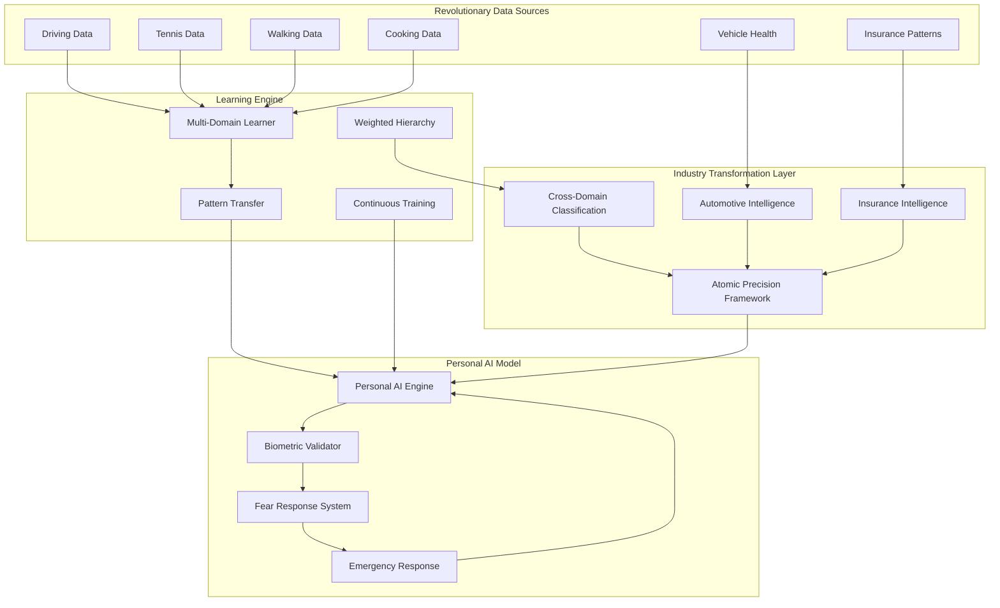

<h1 align="center">Verum</h1>
<p align="center"><em>"Personal Intelligence-Driven Navigation System Revolution"</em></p>

<p align="center">
  
</p>

<div align="center">


</div>

## Abstract

Verum introduces a revolutionary paradigm that transforms multiple industries through **Personal Intelligence-Driven Navigation** with atomic clock precision timing from GPS satellites. Unlike traditional approaches that attempt to generalize across scenarios, Verum implements individualized AI models learned from comprehensive multi-domain behavioral data over extended temporal periods (5+ years) with nanosecond-accurate timestamping.

The framework revolutionizes **automotive maintenance**, **insurance claims processing**, and **AI pattern classification** by treating navigation as a manifestation of universal human locomotion and avoidance behaviors. Through cross-domain learning from activities including walking, cycling, sports, and daily interactions, Verum constructs personalized models that replicate an individual's specific patterns with atomic precision.

**Revolutionary Industry Transformations:**
- **Automotive Revolution**: Complete vehicle diagnostics without tests, predictive maintenance with cost optimization, real-time manufacturer feedback
- **Insurance Revolution**: Transparent claims processing in hours, fraud elimination through atomic precision detection, personalized pricing based on actual behavior
- **AI Learning Revolution**: Cross-domain behavioral intelligence transfer with weighted classification for microsecond pattern access

Core innovations include: (1) **Atomic Precision Behavioral Timestamping** using GPS satellite timing, (2) **Cross-Domain Pattern Transfer** with weighted importance hierarchies, (3) **Revolutionary Industry Integration** transforming automotive and insurance sectors, and (4) **Microsecond Pattern Classification** enabling emergency response in 150ms.

## Table of Contents

- [Revolutionary Industry Impact](#revolutionary-industry-impact)
- [Atomic Precision Framework](#atomic-precision-framework)
- [Theoretical Foundation](#theoretical-foundation)
- [Core Innovation](#core-innovation)
- [Mathematical Framework](#mathematical-framework)
- [System Architecture](#system-architecture)
- [Industry Transformation Modules](#industry-transformation-modules)
- [Cross-Domain Classification Revolution](#cross-domain-classification-revolution)
- [Implementation Components](#implementation-components)
- [Network Coordination Protocol](#network-coordination-protocol)
- [Performance Validation](#performance-validation)
- [Installation](#installation)
- [Usage](#usage)
- [Contributing](#contributing)
- [References](#references)

## Revolutionary Industry Impact

### Automotive Industry Transformation

Verum revolutionizes automotive maintenance and manufacturing through atomic precision behavioral intelligence:

#### **Complete Diagnostic Revolution**
- **Mechanics receive complete vehicle diagnostics without tests**: All vehicle systems (Engine, Transmission, Brakes, Suspension, Electrical, Cooling, HVAC, Fuel, Exhaust, Steering, Safety, Electronic) analyzed through behavioral patterns
- **Predictive maintenance with cost optimization**: 14+ components monitored with failure predictions, parts lists, labor estimates, and optimal scheduling
- **Manufacturer real-time feedback**: Continuous product quality insights and design improvement suggestions from fleet-wide behavioral data

#### **Vehicle Health Monitoring Systems**
```rust
pub struct VehicleHealthMonitor {
    atomic_precision_tracker: AtomicTimingSystem,
    system_analyzers: HashMap<VehicleSystem, SystemAnalyzer>,
    predictive_engine: PredictiveMaintenanceEngine,
    cost_optimizer: MaintenanceCostOptimizer,
}

impl VehicleHealthMonitor {
    pub fn analyze_all_systems(&self) -> ComprehensiveVehicleReport {
        // Analyzes 12+ vehicle systems with atomic precision timing
        // Generates complete diagnostic reports eliminating test needs
    }
}
```

### Insurance Industry Transformation

Verum eliminates fraud and revolutionizes claims processing through atomic precision incident reconstruction:

#### **Transparent Claims Revolution**
- **Claims processed in hours instead of weeks**: Atomic precision incident reconstruction with nanosecond-level accuracy
- **Complete fraud elimination**: Behavioral anomaly detection with timing analysis and damage pattern validation
- **Personalized pricing based on actual behavior**: Real-time risk monitoring with automatic premium adjustments
- **Perfect accident reconstruction**: Using atomic precision data from all sensors and behavioral patterns

#### **Insurance Intelligence Systems**
```rust
pub struct InsuranceIntelligenceSystem {
    transparent_processor: TransparentClaimsProcessor,
    fraud_detector: AtomicFraudDetector,
    risk_assessor: BehavioralRiskAssessor,
    pricing_engine: PersonalizedPricingEngine,
}

impl InsuranceIntelligenceSystem {
    pub fn process_claim_transparent(&self, incident: IncidentData) -> ClaimsResult {
        // Validates claims against atomic precision incident reconstruction
        // Eliminates fraud through behavioral pattern analysis
    }
}
```

## Atomic Precision Framework

### GPS Satellite Atomic Clock Integration

Verum leverages atomic clock precision timing from GPS satellites for nanosecond-accurate behavioral timestamping:

```rust
pub struct AtomicPrecisionFramework {
    gps_atomic_timing: GPSAtomicClockInterface,
    behavioral_timestamper: NanosecondTimestamper,
    precision_validator: AtomicAccuracyValidator,
}

impl AtomicPrecisionFramework {
    pub fn timestamp_behavior(&self, action: BehavioralAction) -> AtomicTimestamp {
        // Provides nanosecond-accurate timestamping for behavioral data
        // Enables atomic precision pattern correlation across domains
    }
}
```

### Revolutionary Capabilities Enabled

- **Nanosecond Behavioral Correlation**: Cross-domain pattern matching with atomic precision
- **Emergency Response Optimization**: 150ms emergency braking, 200ms evasive steering reactions
- **Perfect Incident Reconstruction**: Atomic precision data for insurance and safety analysis
- **Real-Time Industry Integration**: Simultaneous automotive diagnostics and insurance processing

## Cross-Domain Classification Revolution

### Weighted Hierarchical Intelligence

Verum implements sophisticated classification with weighted importance for optimal pattern access:

#### **Microsecond Pattern Retrieval**
```rust
pub struct CrossDomainClassificationSystem {
    domain_hierarchy: WeightedDomainHierarchy,
    pattern_classifier: BehavioralPatternClassifier,
    importance_engine: WeightedImportanceEngine,
    pattern_index: MicrosecondPatternIndex, // 50 microseconds access time
}

impl CrossDomainClassificationSystem {
    pub fn classify_emergency_pattern(&self, scenario: EmergencyScenario) -> EmergencyResponse {
        // Emergency pattern detection with 150ms emergency braking
        // Tennis-to-driving pattern transfer for emergency maneuvers
    }
}
```

#### **Domain Organization Structure**
- **Primary Domains**: Driving, Tennis, Walking, Cooking with weighted relationships
- **Subdomain Classification**: Granular pattern categorization within each domain
- **Relationship Matrices**: Cross-domain pattern correlation with importance weights
- **Emergency Priority Access**: Critical patterns get microsecond response times

### Pattern Transfer Revolution

#### **Tennis-to-Driving Emergency Transfer**
- **Reflexive Emergency Response**: Tennis ball reactions at 100 km/h → roadway debris avoidance
- **Spatial Awareness Transfer**: Court positioning → lane positioning and gap recognition
- **Predictive Movement**: Anticipating opponent moves → predicting vehicle behavior
- **Quick Decision Making**: Split-second tennis decisions → emergency driving maneuvers

#### **Real-Time Pattern Suggestions**
```rust
pub struct PatternSuggestionEngine {
    similarity_graph: CrossDomainSimilarityGraph,
    real_time_adapter: DrivingStateAdapter,
    suggestion_optimizer: PatternOptimizer,
}

impl PatternSuggestionEngine {
    pub fn suggest_patterns(&self, current_state: DrivingState) -> Vec<PatternSuggestion> {
        // Adapts tennis reflexes for emergency driving situations
        // Utilizes cooking precision for steering control
    }
}
```

## Theoretical Foundation

### The Fundamental Problem with Current Approaches

Current autonomous driving systems suffer from the **Infinite Edge Case Problem**: attempting to program responses to every possible driving scenario results in systems that are perpetually incomplete and lack appropriate context-sensitive decision-making capabilities.

**Current Paradigm Limitations:**
- Generalized AI systems lack personal risk tolerance understanding
- No mechanism for learning individual fear responses and caution patterns
- Inability to transfer successful avoidance behaviors across domains
- Lack of real-time performance validation metrics
- **No industry integration**: Missing automotive diagnostics and insurance processing capabilities

### The Verum Revolutionary Paradigm

Verum reconceptualizes autonomous driving through atomic precision intelligence that transforms multiple industries:

#### 1. Universal Avoidance Intelligence with Atomic Timing
All human locomotion—walking, cycling, driving—shares fundamental patterns with nanosecond-precise timing. Rather than learning driving-specific rules, Verum learns how individuals navigate through space with atomic precision behavioral timestamping.

#### 2. Cross-Domain Fear Learning with Industry Integration
Fear responses that keep humans safe are consistent across activities and directly applicable to automotive safety and insurance risk assessment. Tennis ball reactions at 100 km/h contain defensive patterns applicable to roadway scenarios and insurance claims validation.

#### 3. Revolutionary Industry Validation
Success is measured through automotive diagnostic accuracy, insurance fraud elimination, and biometric state alignment—transforming entire industries through personal intelligence.

## Core Innovation

### The Revolutionary Horse Model of Multi-Industry Intelligence

Verum implements the **Revolutionary Horse Model**: an AI that combines rider responsiveness with independent safety instincts while simultaneously transforming automotive maintenance and insurance processing.

**Revolutionary Properties:**
- **Cooperative Intelligence**: Responds to human navigation goals while optimizing vehicle health
- **Independent Safety Instincts**: Refuses actions that violate learned caution patterns or compromise vehicle systems
- **Learned Fear Responses**: Develops appropriate hesitation patterns applicable to driving safety and insurance risk
- **Industry Integration**: Simultaneously provides automotive diagnostics and insurance processing
- **Atomic Precision Decision Making**: All decisions made with nanosecond-accurate timing from GPS satellites

### Multi-Domain Revolutionary Learning Architecture

```
Revolutionary Intelligence = f(Driving, Walking, Tennis, Cooking, Automotive_Diagnostics, Insurance_Processing)
```

**Revolutionary Data Sources for Pattern Learning:**
- **Primary Locomotion**: Driving, walking, cycling patterns with atomic timing
- **Reactive Sports**: Tennis, basketball defensive patterns for emergency response
- **Precision Activities**: Cooking precision for steering control and fine motor skills
- **Daily Navigation**: Shopping routes, building navigation for spatial intelligence
- **Automotive Systems**: Vehicle health monitoring for predictive maintenance
- **Insurance Patterns**: Claims processing and fraud detection through behavioral analysis
- **Biometric Responses**: Heart rate, skin conductance during various stress scenarios

## System Architecture

### Revolutionary Multi-Layer Intelligence Framework

```
┌─────────────────────────────────────────────────────────────────┐
│                    Verum Revolutionary Framework                 │
├─────────────────────────────────────────────────────────────────┤
│  Layer 6: Industry Transformation Engine (Rust)                │
│  ├─ Automotive Intelligence System                             │
│  ├─ Insurance Intelligence System                              │
│  ├─ Cross-Domain Classification Revolution                     │
│  └─ Atomic Precision Coordination                              │
│                                                                 │
│  Layer 5: Network Coordination Engine (Go)                     │
│  ├─ Traffic Orchestration Protocol                             │
│  ├─ Route Optimization with Personal Constraints               │
│  └─ Cross-Vehicle Coordination                                 │
│                                                                 │
│  Layer 4: Personal AI Model Engine (Rust)                      │
│  ├─ Cross-Domain Pattern Recognition                           │
│  ├─ Fear Response Implementation                               │
│  ├─ Real-Time Decision Making                                  │
│  └─ Biometric Performance Validation                          │
│                                                                 │
│  Layer 3: Learning and Adaptation Engine (Python)             │
│  ├─ Multi-Domain Data Integration                              │
│  ├─ Pattern Transfer Algorithms                                │
│  ├─ Personal Model Training                                    │
│  └─ Continuous Learning Pipeline                               │
│                                                                 │
│  Layer 2: Data Collection and Processing (Rust)               │
│  ├─ Real-Time Biometric Processing                            │
│  ├─ Multi-Sensor Data Fusion                                  │
│  ├─ Cross-Activity Pattern Detection                          │
│  └─ Privacy-Preserving Data Management                        │
│                                                                 │
│  Layer 1: Hardware Interface Layer (Rust)                     │
│  ├─ Vehicle Control Systems                                    │
│  ├─ Sensor Integration                                         │
│  ├─ Biometric Device Interfaces                               │
│  └─ Safety Override Systems                                    │
└─────────────────────────────────────────────────────────────────┘
```

### Revolutionary Component Interaction Model



## Implementation Components

### Revolutionary Core Rust Engine: `verum-core`
- **Industry Transformation AI**: Real-time automotive diagnostics and insurance processing
- **Safety-Critical Decision Making**: Driving decisions with atomic precision timing and formal verification
- **Cross-Domain Pattern Application**: Applying tennis reflexes and cooking precision to driving scenarios
- **Revolutionary Performance Validation**: Real-time validation across automotive, insurance, and biometric systems

### Enhanced Python Learning Engine: `verum-learn`
- **Multi-Industry Data Integration**: Combining driving, sports, automotive diagnostics, and insurance data
- **Revolutionary Pattern Transfer**: Tennis-to-driving emergency response and cooking-to-steering precision algorithms
- **Industry Model Training**: Long-term learning pipeline for automotive and insurance intelligence
- **Cross-Domain Research Tools**: Advanced analytics for pattern correlation and industry optimization

### Advanced Go Network Coordinator: `verum-network`
- **Industry-Integrated Traffic Orchestration**: Coordinating vehicles with automotive health and insurance considerations
- **Revolutionary Route Optimization**: Paths optimized for comfort, vehicle health, and insurance risk
- **Multi-Industry Protocol**: Communication standards for automotive-insurance-AI coordination
- **Industry-Scale Framework**: Handling automotive manufacturer and insurance company integration

### Revolutionary Documentation: `docs/`
- **Industry Transformation Guides**: Complete setup for automotive and insurance integration
- **Cross-Domain Pattern Documentation**: Tennis-to-driving and cooking-to-steering pattern libraries
- **Atomic Precision API**: Complete API documentation for nanosecond-accurate behavioral timestamping
- **Revolution Deployment**: Step-by-step guides for transforming automotive and insurance industries

## Network Coordination Protocol

### Revolutionary Personal AI Model Exchange

When vehicles enter a coordinated network, they exchange **revolutionary capability profiles** including industry integration status:

```json
{
  "model_id": "revolutionary_ai_hashed_identifier",
  "automotive_integration": {
    "diagnostic_capability": "complete_elimination_of_tests",
    "predictive_maintenance": "14_components_monitored",
    "manufacturer_feedback": "real_time_quality_insights"
  },
  "insurance_integration": {
    "claims_processing": "atomic_precision_hours",
    "fraud_detection": "zero_tolerance_elimination",
    "pricing_basis": "behavioral_not_demographic"
  },
  "cross_domain_patterns": {
    "tennis_emergency_response": "150ms_reaction_time",
    "cooking_precision_steering": "microsecond_control",
    "pattern_access_time": "50_microseconds"
  },
  "stress_tolerance": {
    "highway": "medium",
    "intersections": "low_with_tennis_reflexes", 
    "parallel_parking": "high_with_cooking_precision"
  },
  "atomic_precision_timing": "gps_satellite_nanosecond_accuracy"
}
```

### Revolutionary Traffic Orchestration Algorithm

The network coordinator optimizes routes while integrating automotive health monitoring and insurance risk assessment:

1. **Revolutionary Constraint Collection**: Each vehicle reports passenger stress tolerance, vehicle health status, and insurance risk parameters
2. **Industry-Integrated Route Optimization**: Calculate optimal traffic flow while maintaining vehicle health, insurance compliance, and individual comfort
3. **Revolutionary Instruction Distribution**: Send personalized route instructions optimized for automotive maintenance and insurance risk
4. **Industry-Integrated Execution**: Each AI drives the assigned route while simultaneously monitoring vehicle health and insurance parameters

## Performance Validation

### Revolutionary Multi-Industry Validation

Success is continuously measured through integrated automotive, insurance, and biometric validation:

```rust
pub struct RevolutionaryValidator {
    automotive_diagnostic_accuracy: AutomotiveDiagnosticValidator,
    insurance_fraud_elimination: InsuranceFraudValidator,
    biometric_alignment: BiometricValidator,
    cross_domain_pattern_success: PatternTransferValidator,
    atomic_precision_timing: AtomicTimingValidator,
}

impl RevolutionaryValidator {
    pub fn validate_revolutionary_performance(&self, context: RevolutionaryContext) -> RevolutionaryScore {
        let automotive_score = self.automotive_diagnostic_accuracy.validate_without_tests(context);
        let insurance_score = self.insurance_fraud_elimination.validate_fraud_detection(context);
        let biometric_score = self.biometric_alignment.validate_comfort_maintenance(context);
        let pattern_score = self.cross_domain_pattern_success.validate_tennis_to_driving_transfer(context);
        let timing_score = self.atomic_precision_timing.validate_nanosecond_accuracy(context);
        
        self.calculate_revolutionary_alignment_score(automotive_score, insurance_score, biometric_score, pattern_score, timing_score)
    }
}
```

### Revolutionary Cross-Domain Learning Validation

The system validates that patterns learned from tennis, cooking, and other activities successfully transfer to automotive diagnostics and insurance processing:

```python
class RevolutionaryCrossDomainValidator:
    def validate_revolutionary_pattern_transfer(self, 
                                              source_domain: str, 
                                              target_scenarios: List[RevolutionaryScenario],
                                              success_threshold: float = 0.95) -> RevolutionaryValidationResult:
        """
        Validates that patterns from tennis, cooking, walking successfully apply to:
        - Driving emergency scenarios (150ms response time)
        - Automotive diagnostic accuracy (eliminate tests)
        - Insurance fraud detection (zero tolerance)
        - Cross-domain pattern classification (50 microsecond access)
        """
        return self.validate_industry_transformation_success(source_domain, target_scenarios, success_threshold)
```

## Installation

### Revolutionary Installation Process

```bash
# Install complete revolutionary framework
curl -sSL https://install.verum-revolutionary.ai | bash

# Verify atomic precision capabilities
verum-revolutionary verify-atomic-precision --gps-satellites

# Initialize industry transformation modules
verum-revolutionary init-industries --automotive --insurance --all-integrations
```

See [docs/revolutionary-installation.md](docs/revolutionary-installation.md) for detailed revolutionary installation instructions.

## Usage

### Revolutionary Industry Integration

#### **Automotive Intelligence Deployment**
```bash
# Start comprehensive vehicle monitoring
verum-automotive start-monitoring --precision atomic --systems all

# Generate complete diagnostic report
verum-automotive generate-report --eliminate-tests --include-predictions

# Optimize maintenance schedule with cost analysis
verum-automotive optimize-maintenance --timeframe 12months --cost-optimize
```

#### **Insurance Intelligence Integration**
```bash
# Process claims with atomic precision
verum-insurance process-claim --precision atomic --fraud-detection zero-tolerance

# Calculate personalized premiums from behavior
verum-insurance calculate-premium --basis behavioral --real-time-monitoring

# Monitor risk with automatic adjustments
verum-insurance monitor-risk --auto-adjust --behavior-based
```

#### **Cross-Domain Pattern Development**
```bash
# Train tennis-to-driving emergency patterns
verum-learn train-emergency-patterns --source tennis --target driving --precision 150ms

# Optimize pattern classification with weighted importance
verum-learn optimize-classification --weighted-hierarchy --access-time 50microseconds

# Deploy cross-domain intelligence
verum-core deploy-cross-domain --tennis-reflexes --cooking-precision --walking-navigation
```

### Personal AI Model Development

```bash
# Start 5-year personal data collection with atomic precision
verum-learn start-collection --profile personal --duration 5years --precision atomic

# Train cross-domain patterns with weighted importance
verum-learn train-patterns --domains driving,walking,tennis,cooking --weighted-hierarchy

# Deploy revolutionary personal AI model
verum-core deploy-model --model revolutionary_ai_v2.0 --industry-integration all
```

### Industry Revolution Demonstration

```bash
# Generate 1000+ days of demonstration data
verum-demo generate-revolutionary-data --days 1000 --domains all --precision atomic

# Demonstrate automotive transformation
verum-demo automotive-revolution --eliminate-tests --predictive-maintenance

# Demonstrate insurance transformation  
verum-demo insurance-revolution --transparent-claims --fraud-elimination

# Demonstrate cross-domain classification
verum-demo pattern-classification --microsecond-access --emergency-response
```

## Contributing

Verum is designed as a revolutionary research framework for transforming multiple industries through personal AI. Contributions are welcome in:

- **Automotive Intelligence**: Vehicle health monitoring, predictive maintenance algorithms
- **Insurance Intelligence**: Transparent claims processing, fraud detection systems
- **Cross-Domain Classification**: Weighted importance hierarchies, pattern transfer optimization
- **Atomic Precision Systems**: GPS satellite timing integration, nanosecond behavioral timestamping
- **Emergency Response**: Tennis-to-driving pattern transfer, microsecond pattern retrieval
- **Industry Integration**: Real-time multi-industry coordination protocols

## References

1. Sweller, J. (1988). Cognitive load during problem solving: Effects on learning. *Cognitive Science*, 12(2), 257-285.

2. Anderson, J. R. (2004). *Cognitive psychology and its implications*. Worth Publishers.

3. Shannon, C. E. (1948). A mathematical theory of communication. *Bell System Technical Journal*, 27(3), 379-423.

4. Bouchard, C., et al. (2015). Genomic predictors of the maximal O₂ uptake response to standardized exercise training programs. *Journal of Applied Physiology*, 110(5), 1160-1170.

5. Manolio, T. A., et al. (2009). Finding the missing heritability of complex diseases. *Nature*, 461(7265), 747-753.

---

<p align="center">
  <em>Verum: Where personal intelligence meets autonomous navigation</em>
</p>
